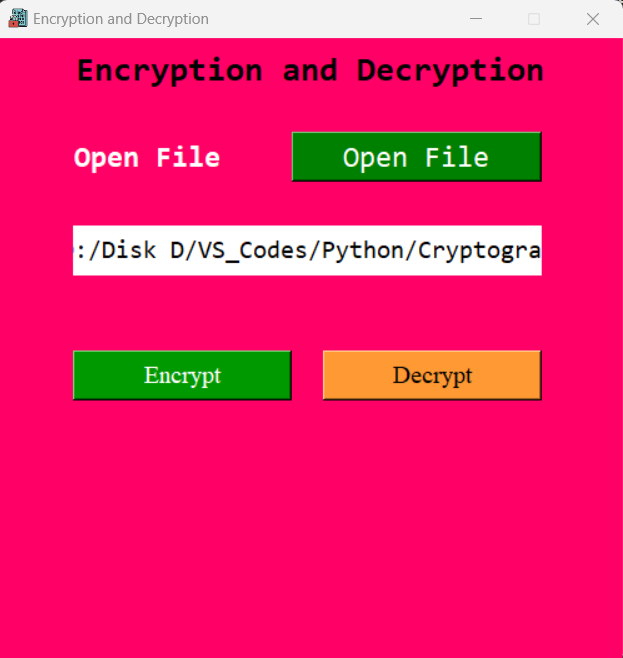
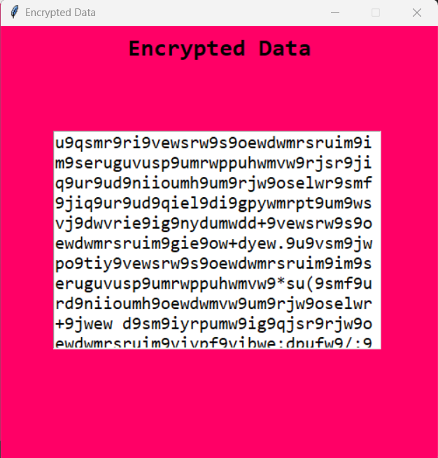
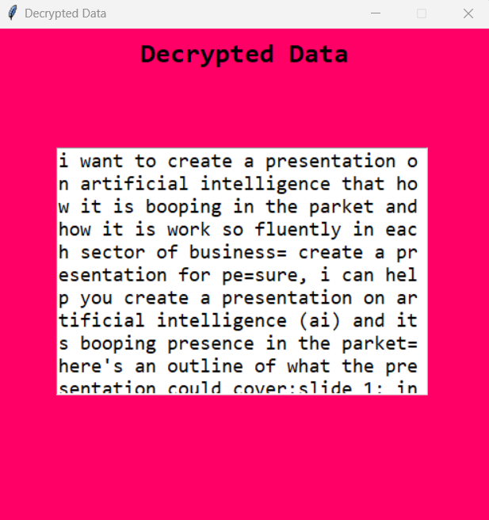

This code is a simple graphical user interface (GUI) for encrypting and decrypting files using the functions from `cryptomachine.py`. It uses the `tkinter` module to create the GUI.

Here's what the code does:

1. Imports the necessary modules and functions.
2. Defines a class `App` for the GUI.
3. Initializes the GUI with a title, size, and background color.
4. Creates a frame and a label for the heading.
5. Adds a button for opening files.
6. Defines a method `openfile` for opening the selected file and adding buttons for encryption and decryption.
7. Defines a method `list_to_string` for converting a list to a string.
8. Defines a method `encrypt` for encrypting the selected file and displaying the result in a new window.
9. Defines a method `decrypt` for decrypting the selected file and displaying the result in a new window.

Note that the `encrypt` and `decrypt` methods both write the results to new files (with "encrypted_file.txt" and "decrypted_file.txt" as the filenames) instead of modifying the original file. Also, the `decrypt` method currently prints the decrypted data to the console, which may not be desirable behavior.

Overall, the code appears to be well-organized and easy to understand. However, there may be some potential issues with error handling, especially if the user selects invalid files or inputs.

#### Outputs

##### Encrypted Output

##### Decrypted Output

